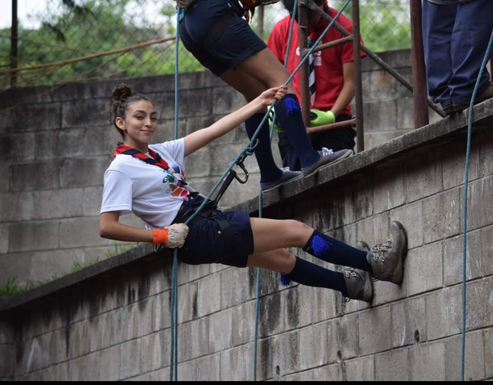
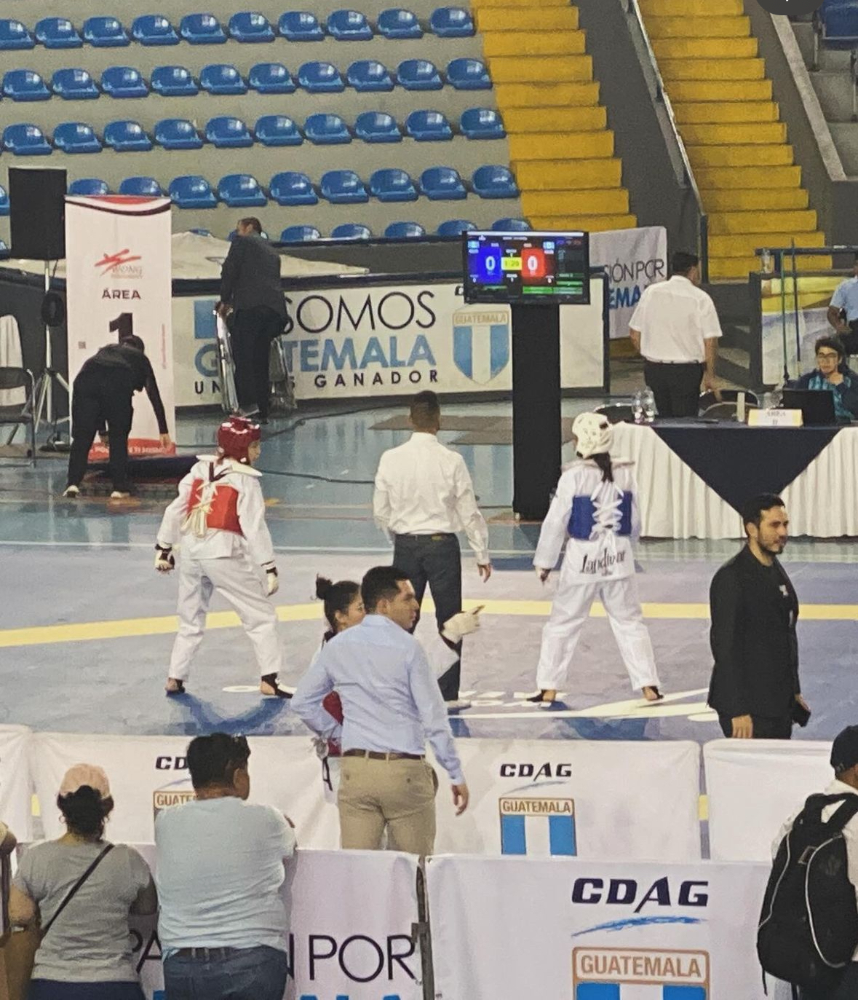
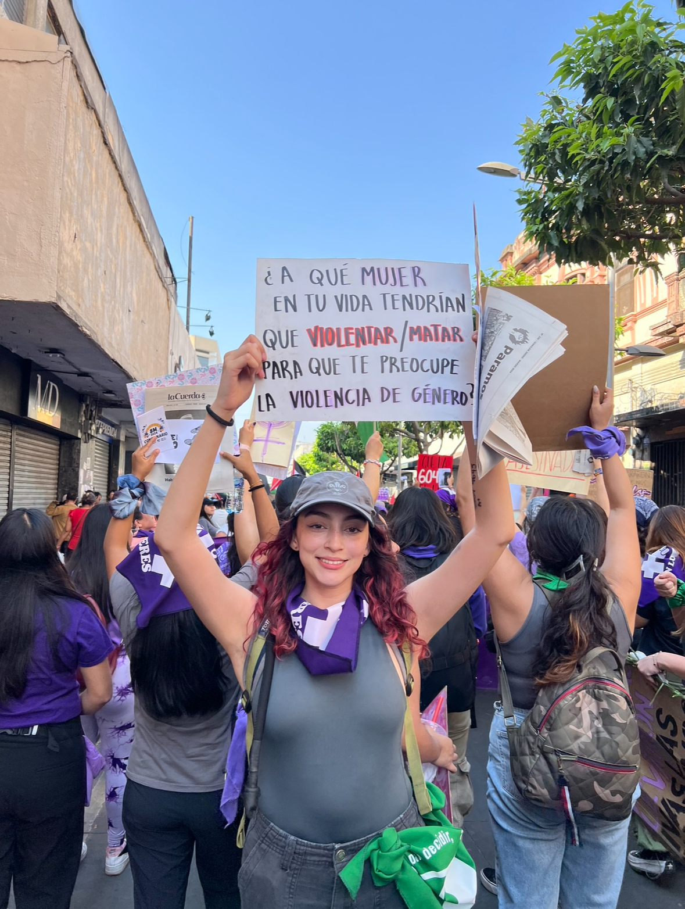
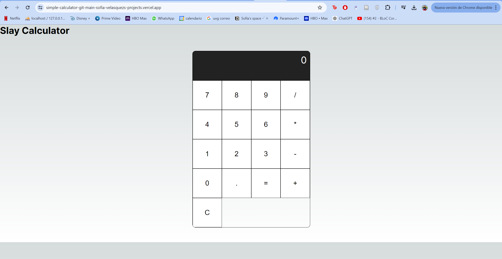
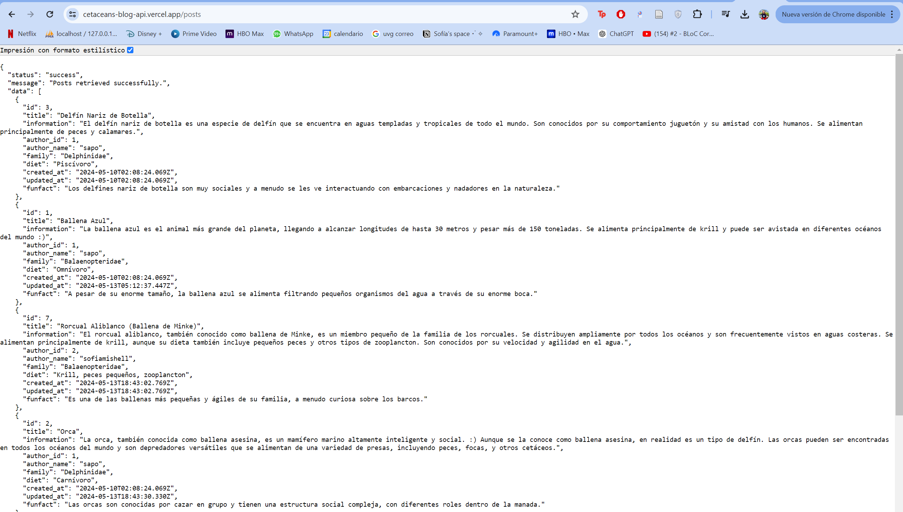
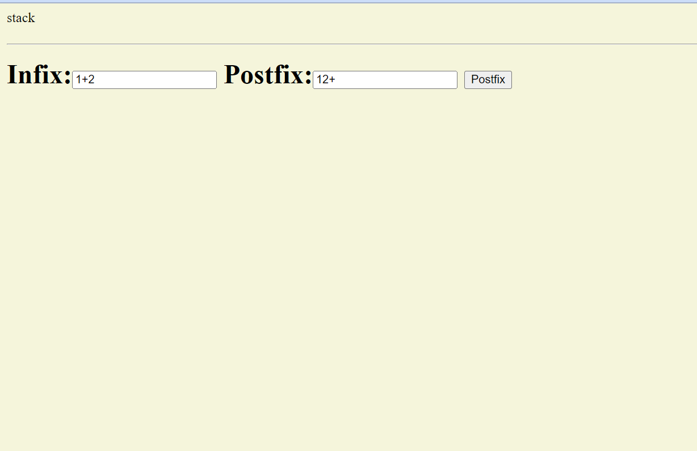
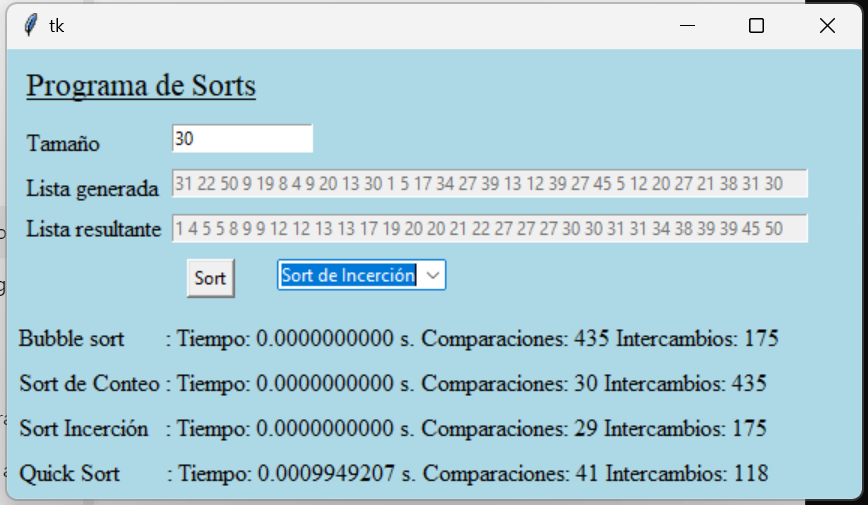
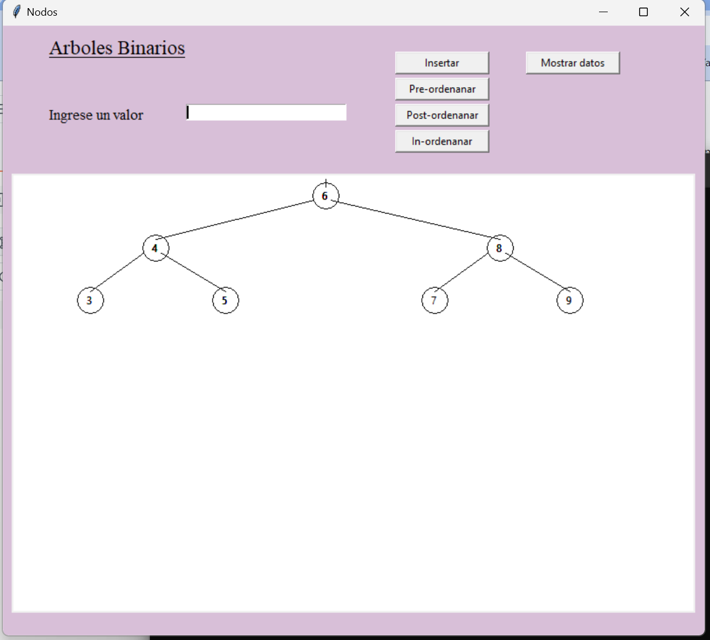

# Sofía Velásquez Portfolio

Welcome to my portfolio repository! This project showcases my skills, experiences, and projects in a visually appealing and interactive way.

## 🚀 Demo
Check out the live demo of my portfolio [here](https://portafolio-sofia-two.vercel.app/) 

## 📑 Table of Contents
- [About Me](#about-me)
- [Projects](#projects)
- [Basic Algorithms](#basic-algorithms)
- [Skills](#skills)
- [Contact](#contact)

## 🧑‍💻 About Me
Hello! I&apos;m Sofía Velásquez, a multifaceted individual with a passion for learning, creativity, and making a positive impact. My journey in programming began at the age of 12, and I&apos;ve since developed strong skills in various programming languages and technologies. I am a quick learner, able to pick up new programming languages and technologies swiftly. My creativity and innovative mindset have led to various successful projects and entrepreneurial ventures, having started my first business at the age of 7. This background has instilled in me a keen business mind and an unwavering dedication to excellence.

### Personal Highlights
- **Scout**: I was a Scout for 8 years, deeply involved in various activities. I achieved the highest leadership rank in my category and participated in multiple competitions and training endorsed by the United Nations.
  
- **Taekwondo Federation**: In 2023, I was federated in Taekwondo and achieved second place in national competitions, showcasing my dedication and skill in the sport.
  
- **Daily MMA Training**: I currently train in Mixed Martial Arts (MMA) daily, maintaining my physical fitness and enhancing my combat skills.
  
- **Social Activism**: I am actively involved in social activism, advocating for women&apos;s rights and protesting against injustices that I feel strongly about.
  

## 💼 Projects
### Cetacean Blog
A blog about cetaceans built with Vite and React. It includes user token validation, API connections, and CRUD functionalities for posts.
- [Repository](https://github.com/Sofiamishel2003/cetacean-blog)
- 

### Calculator
A calculator with decimal division and floating-point sum capabilities, built with Next.js and React. It also includes implemented testing.
- [Repository](https://github.com/Sofiamishel2003/calculator)
- 

### BI Dashboard
A BI dashboard report for a company with a star-schema organized database, utilizing Tableau and Power BI for data visualization.
- [Repository](https://github.com/Sofiamishel2003/bi-dashboard)
- 

### Cetacean API
An API for cetaceans including token authentication, built with Express and Node.js.
- [Repository](https://github.com/Sofiamishel2003/cetacean-api)
- 

## 🧮 Basic Algorithms
### Towers of Hanoi
A visual representation of the Towers of Hanoi problem implemented using stacks in Python with a Tkinter GUI.
- 

### Infix to Postfix Converter
A JavaScript implementation of an infix to postfix expression converter using stacks.
- 

### Sorting Algorithms
A comparison of various sorting algorithms (Bubble Sort, Counting Sort, Insertion Sort, Quick Sort) implemented in Python.
- 

### Binary Trees
A visual representation of binary trees implemented in Python with a Tkinter GUI.
- 

## 💻 Skills
### Technical Skills
#### Languages
- JavaScript <i className="devicon-javascript-plain colored"></i>
- TypeScript <i className="devicon-typescript-plain colored"></i>
- Python <i className="devicon-python-plain colored"></i>
- C# <i className="devicon-csharp-plain colored"></i>
- HTML <i className="devicon-html5-plain colored"></i>
- PHP <i className="devicon-php-plain colored"></i>
- Arduino <i className="devicon-arduino-plain colored"></i>

#### Frameworks & Libraries
- React <i className="devicon-react-original colored"></i>
- Redux <i className="devicon-redux-original colored"></i>
- Node.js <i className="devicon-nodejs-plain colored"></i>
- Express <i className="devicon-express-original colored"></i>
- Flutter <i className="devicon-flutter-plain colored"></i>
- Dart <i className="devicon-dart-plain colored"></i>
- Kotlin <i className="devicon-kotlin-plain colored"></i>

#### Databases
- MySQL <i className="devicon-mysql-plain colored"></i>
- PostgreSQL <i className="devicon-postgresql-plain colored"></i>

### Language Skills
- **Spanish**: Native
  
- **English**: B2
  

### Personal Skills
- Leadership <i className="fas fa-users"></i>
- Organizing and synthesizing information <i className="fas fa-info-circle"></i>
- Event and meeting planning <i className="fas fa-calendar-alt"></i>
- Self-taught <i className="fas fa-graduation-cap"></i>
- Sociable <i className="fas fa-user-friends"></i>
- Good computer and software skills <i className="fas fa-desktop"></i>
- Quick learner of programming languages <i className="fas fa-code"></i>
- Creativity and innovative mindset <i className="fas fa-lightbulb"></i>

## 📞 Contact
Feel free to get in touch with me through the contact form on my portfolio or directly via email at [sofiamishel203@gmail.com](mailto:sofiamishel203@gmail.com).

## 📄 License
This project is licensed under the MIT License. See the [LICENSE](LICENSE) file for more details.

---

Thank you for visiting my portfolio! I hope you enjoy exploring my work.
